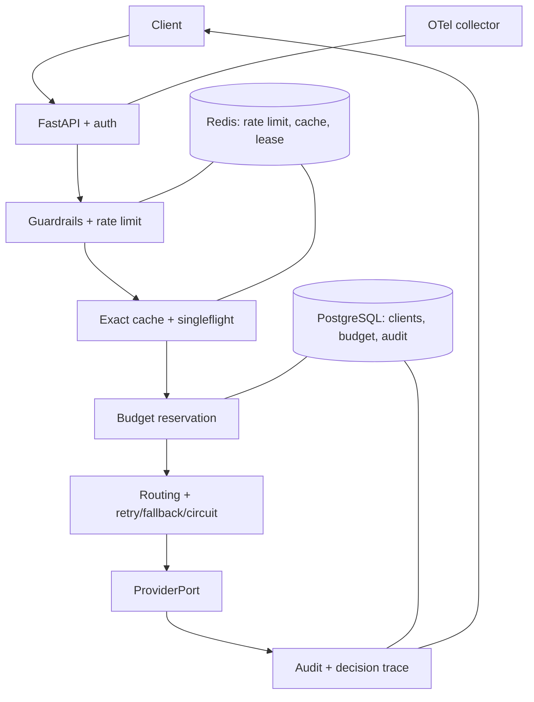

# mini-llm-gateway

> An explainable, failure-tested LLM gateway focused on routing, governance,
> distributed state, and reproducible production evidence.

It is more than an API proxy: every request has a policy decision, budget
outcome, provider attempt chain, audit record, and prompt-free trace. It runs
locally with mock providers—no paid provider key is required.

[](https://github.com/QuietYouthKept/mini-llm-gateway/actions)

---

## Why this project

When teams call LLMs directly from business code, every service repeats the same
provider-switching, retry, rate-limit, and budget-tracking logic. A gateway moves
that logic into one place so the rest of the system talks to a single, stable,
auditable API — the same way LiteLLM Proxy, Portkey, and Cloudflare AI Gateway do.

## 5-minute quickstart

Requires Python 3.11+. The local/demo path uses SQLite and mock providers.

```powershell
# Windows PowerShell
py -3.11 -m venv .venv
.\.venv\Scripts\python.exe -m pip install -e ".[dev]"
.\.venv\Scripts\python.exe -m uvicorn app.main:app --reload
```

```bash
# macOS / Linux
python3.11 -m venv .venv
.venv/bin/python -m pip install -e ".[dev]"
.venv/bin/python -m uvicorn app.main:app --reload
```

In a second terminal:

```bash
curl http://localhost:8000/health
curl http://localhost:8000/v1/chat \
  -H "Authorization: Bearer demo-key" \
  -H "Content-Type: application/json" \
  -d '{"profile":"fast-chat","messages":[{"role":"user","content":"hi"}]}'
```

For a production-like local stack, install `.[production]`, configure
`GW_DATABASE_URL`, `GW_REDIS_URL`, and `GW_CACHE_BACKEND=redis`, then use the
backend guide and the two-replica probes in `scripts/`.

## Architecture



```
                         HTTP clients
                 curl · openai SDK (base_url)

                             |  Bearer <api-key>
                             v
   ┌───────────────────────────────────────────────────────┐
   │  interfaces/http                                       │
   │  /v1/chat · /v1/chat/completions · /v1/requests/{id}  │
   │  /metrics · /admin/*                                   │
   │  auth · request_id middleware · error handlers         │
   └───────────────────────────────┬───────────────────────┘
                                   |
   ┌───────────────────────────────v───────────────────────┐
   │  application (use cases)                               │
   │  ChatService pipeline:                                 │
   │    streaming → rate limit → profile → guardrail        │
   │    → budget → routing → fallback(retry+circuit)        │
   │    → output guardrail → budget commit → audit log      │
   └───────────────┬────────────────────────┬───────────────┘
                   |                        |
   ┌───────────────v───────────┐  ┌─────────v───────────────┐
   │  domain                   │  │  infrastructure          │
   │  ProviderPort (abstract)  │  │  providers: mock /       │
   │  domain models + errors   │  │  openai_compatible       │
   │  ports & use-case DTOs    │  │  sqlite · metrics · yaml │
   └───────────────────────────┘  └─────────────────────────┘
```

The composition root is `app/core/container.py` — one `AppContainer` holds every
wired service, which is what makes `POST /admin/reload-config` a one-liner.

## Features

- **OpenAI-compatible API** — point the official `openai` SDK at this gateway
  (`base_url`) and it works unchanged.
- **API key auth** — clients authenticate at the gateway, not at each provider.
- **Provider routing & fallback** — priority routing with fallback chains that
  degrade gracefully on error / timeout / bad status.
- **Retry + circuit breaker** — exponential backoff on retryable errors, and a
  per-provider closed/open/half-open breaker to stop cascading failures.
- **Rate limiting & token/cost budgets** — atomic reserve/settle/release with a
  strict reservation envelope on SQLite or PostgreSQL (with `Retry-After`).
- **Guardrails** — config-driven input/output policies (blocked regex, length,
  PII & prompt-injection hooks) with audit output.
- **Request auditing** — every call writes `request_logs` + `provider_attempts`;
  `GET /v1/requests/{id}` replays the full attempt chain.
- **Observability** — structured JSON logs, correlated `request_id`, Prometheus
  metrics, and prompt-free OpenTelemetry OTLP traces.
- **Real provider adapter** — `OpenAICompatibleProvider` speaks to any
  OpenAI-style `/chat/completions` endpoint (OpenAI, DeepSeek, Qwen, vLLM…).
- **Config hot reload** — `POST /admin/reload-config` replaces the policy
  snapshot while preserving compatible limiter/cache/breaker/metrics state.
- **Explainable routing** — every response carries a `decision_trace` recording
  *why* a provider was selected, skipped, retried, or fell back.
- **Failure replay** — `scripts/replay_request.py` defaults to deterministic
  offline replay with zero provider calls; live replay is an explicit opt-in.
- **Exact prompt cache** — identical prompts skip the provider call entirely;
  local and Redis backends store only post-guardrail output. Redis deployments
  coalesce a cold miss globally with an owner-safe, TTL-bound lease; outage
  degradation is explicitly local-only.
- **Usage provenance** — provider token usage is settled when available, with
  explicit estimator fallback and separate estimated/actual audit fields.
- **OWASP guardrail attack pack** — a config-driven security eval covering
  prompt injection, system-prompt leakage, PII, and unbounded consumption.
- **Local real-model path** — the same OpenAI-compatible adapter targets Ollama
  or vLLM, so the gateway is not mock-only.

Or use Docker for the same demo path:

```bash
docker compose up --build
```

## Request lifecycle

`auth → rate limit → profile → input guardrail → exact cache/singleflight →
budget reserve → route/retry/fallback → output guardrail → settle/release →
cache/audit/metrics/trace`.

## Failure handling and distributed state

| State | Backend | Scope |
| --- | --- | --- |
| Client auth | config / PostgreSQL | deployment |
| Budget + audit | SQLite / PostgreSQL | database scope |
| Rate limit | memory / Redis | process / deployment |
| Cache | memory / Redis | process / deployment |
| Singleflight | local event / Redis lease | process / deployment |
| Circuit breaker | memory | process/provider |
| Metrics | local exporter | process |
| Traces | OTel exporter | deployment |

| Dependency | Actual failure semantics |
| --- | --- |
| Redis rate limit | fail closed with 503 by default |
| Redis cache | fail-open cache miss |
| Redis singleflight | bounded local-singleflight degradation |
| PostgreSQL budget/audit | request fails closed; no retry loop is hidden |
| OTel exporter | request continues; tracing is best-effort |

## Endpoints

| Method | Path | Description |
| --- | --- | --- |
| GET | `/health` | Health check |
| GET | `/live` | Process-only liveness (does not call dependencies) |
| GET | `/ready` | Traffic readiness: DB/schema, mandatory Redis rate limit, and usable Provider |
| GET | `/health/dependencies` | Admin-only, secret-free dependency status |
| POST | `/v1/chat` | Gateway-native chat (verbose governance metadata) |
| POST | `/v1/chat/completions` | OpenAI-compatible chat completions |
| GET | `/v1/requests/{request_id}` | Request audit trail (with attempt chain) |
| GET | `/metrics` | Prometheus metrics |
| GET | `/admin/config` | Redacted config (admin key) |
| POST | `/admin/reload-config` | Hot reload config (admin key) |
| POST | `/admin/reconcile-budget-reservations` | Explicitly reclaim expired crash leases (admin key) |

Auth: `Authorization: Bearer <api-key>` or `x-api-key`. Admin endpoints use
`x-admin-key`. The checked-in static keys are **local-demo only**. Production
rejects plaintext client/admin/provider keys: use `clients[].api_key_hash`,
`admin.api_key_env`, and `providers.*.http.api_key_env`.

## Demo and evidence

```bash
make demo                 # 10 failure-injection scenarios, PASS/FAIL
make demo-report          # writes docs/demo-report.md (traces + metrics)
make replay REQUEST_ID=x  # replay a historical request, detect regressions
make experiment           # creates evidence/load/<run_id>/ with a reproducible Stub manifest
.venv/Scripts/python scripts/final_demos.py  # 4 concise acceptance demos
```

`make demo-report` renders a markdown report — see
[docs/demo-report.md](docs/demo-report.md) — with the explainable decision trace
for each routing scenario and a metrics snapshot.

The concise operator demo is documented in [docs/demo-guide.md](docs/demo-guide.md).
The [experiment runbook](docs/experiment-runbook.md) defines the evidence contract,
phase-level latency attribution, and separate Stub versus real-provider runs.

## Verification and development

```bash
make test           # pytest (unit + integration)
make lint           # ruff
make eval           # config-driven eval harness (eval/eval_cases.yaml)
make security-eval  # OWASP attack pack (eval/security_cases.yaml)
make verify         # lint + compile + tests + both eval suites
```

## Configuration

Everything is driven by `config/config.yaml`: clients (rate limit + budget),
providers (mock or `openai_compatible`), model profiles (routing + fallback),
retry, circuit breaker, guardrails, metrics, admin, and observability. The
included DeepSeek profile reads `DEEPSEEK_API_KEY` from the process environment;
see the [experiment runbook](docs/experiment-runbook.md#deepseek-profile) for a
small-traffic validation command.
Request bodies and replay payloads are independently opt-in under `logging`;
both are disabled in the checked-in config.

Runtime backend selection is environment-driven:

| State | Local default | Shared option | Selection |
| --- | --- | --- | --- |
| budget + audit | SQLite | PostgreSQL | `GW_DATABASE_URL=postgresql://...` |
| rate limit | in-process | Redis | `GW_REDIS_URL=redis://...` |
| exact cache + singleflight | in-process | Redis | `GW_CACHE_BACKEND=redis` plus `GW_REDIS_URL` |
| traces | bounded local recorder | OTLP/HTTP | `OTEL_EXPORTER_OTLP_TRACES_ENDPOINT=http://.../v1/traces` |

Install shared-backend dependencies with `uv pip install -e ".[production]"`.
Public dataset tooling additionally uses `.[datasets]`.

## Evidence

The 2026-08-23 hardening pass used deterministic WildChat and UltraChat fixtures,
real Uvicorn processes, a local OpenAI-compatible fault provider, disposable
Redis/PostgreSQL/OTel containers, and a fresh copied checkout. See
[the evidence report](docs/production-hardening-report-2026-08-23.md),
[formal test cards](docs/test-cards/public-dataset-production-evidence.md), and
[bounded load results](docs/load-test-results-2026-08-23.md).
The RC snapshot is [docs/releases/v1.0.0-rc1-evidence.md](docs/releases/v1.0.0-rc1-evidence.md).

## Security and known limitations

- **Single-tenant release boundary**: `gateway.tenant_mode` is fixed to
  `single`. Deploy one database, Redis namespace, domain, and KMS/secret scope
  per organization. Shared multi-tenant operation is rejected rather than
  pretending rows and cache keys are tenant isolated.
- **Migration control plane**: PostgreSQL startup verifies an immutable
  checksummed `schema_migrations` ledger; it does not run DDL automatically.
  Run `GW_DATABASE_URL=... python scripts/migrate_postgres.py` as an explicit
  one-shot deployment job. SQLite retains a local checksum ledger for demos.
- **Deployment manifests**: `docker-compose.yml` is development-only. The
  Kubernetes baseline in `deploy/kubernetes/gateway.yaml` uses non-root,
  read-only filesystem, resource limits, PDB, NetworkPolicy, and `/ready` /
  `/live` probes. Replace its image placeholder with a signed digest and make
  the egress policy specific to the target cluster before applying it.

- **Local-first defaults**: SQLite budget/audit works across local processes;
  in-process rate limit/cache/breakers do not. Redis rate limit/cache and
  PostgreSQL budget/audit adapters are implemented and runtime-verified, but
  operating backups, HA, TLS, credentials, dashboards, and alerting remains the
  deployer's responsibility.
- **Distributed singleflight is best-effort**: with Redis available, identical
  cache misses are globally coalesced. On Redis outage cache and singleflight
  fail open to local behavior; the shared rate limiter is fail-closed by default.
- **Circuit breakers remain process-local** by design.
- **Hot reload preserves retired resources until shutdown** so in-flight work is
  safe; repeated reloads can temporarily retain extra clients/connections.
- **Offline replay simulates routing decisions** from recorded metadata. It does
  not execute providers unless live replay is explicitly requested.
- **Request audit bodies remain opt-in** and are disabled by default; failed
  provider attempts are available in the authenticated request audit endpoint.
- **Guardrails are heuristics**, not a guarantee against prompt injection or PII
  leakage — they provide configurable policy hooks + audit logs.
- **Streaming** uses SSE (`event: message`, `usage`, `done`) with incremental
  output guardrails. It is intentionally uncached: a later policy violation
  can stop future chunks but cannot retract text already delivered. Client
  cancellation settles observed output rather than releasing the full budget.

## Project structure

```
app/
  domain/          models, ports, errors (no framework deps)
  application/     services + use-case orchestration
  infrastructure/  providers, sqlite, config, observability
  interfaces/http/ routes, schemas, dependencies, middleware
  core/            container (composition root), settings, startup
tests/             unit + integration tests
eval/              eval harness + OWASP security cases
scripts/           demo, demo-report, replay scripts
```

See [docs/architecture.md](docs/architecture.md) and the ADRs under `docs/adr/`
for the reasoning behind key decisions.

See [CONTRIBUTING.md](CONTRIBUTING.md), [SECURITY.md](SECURITY.md), and
[docs/roadmap-v1.md](docs/roadmap-v1.md) for development, reporting, and
post-v1 direction.
